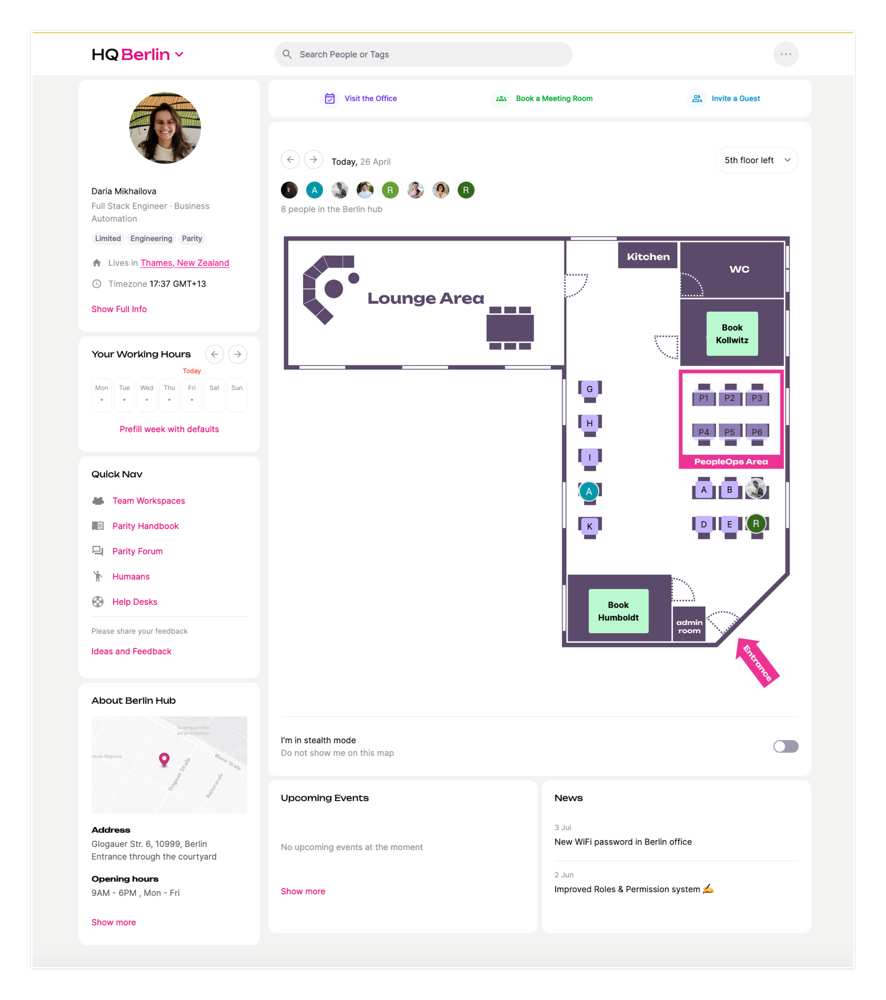
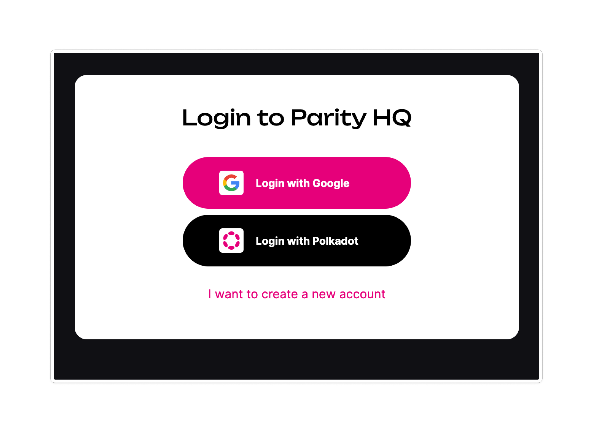
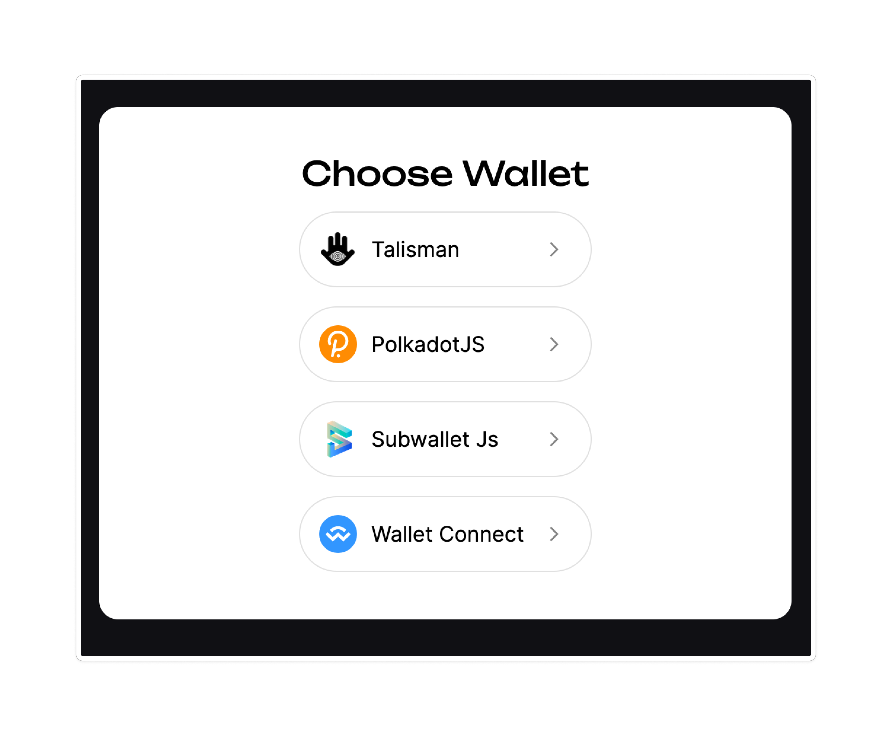
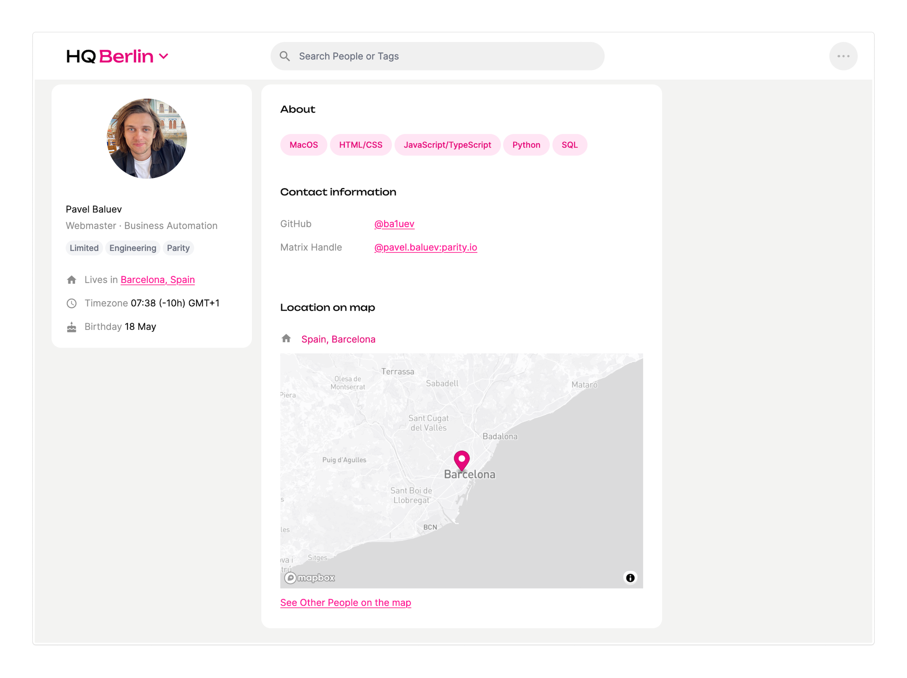
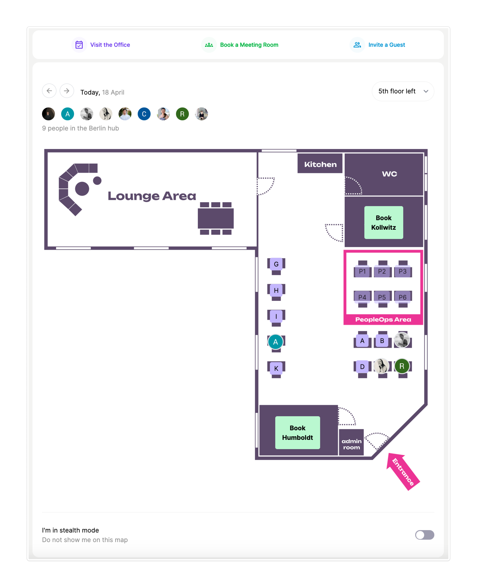
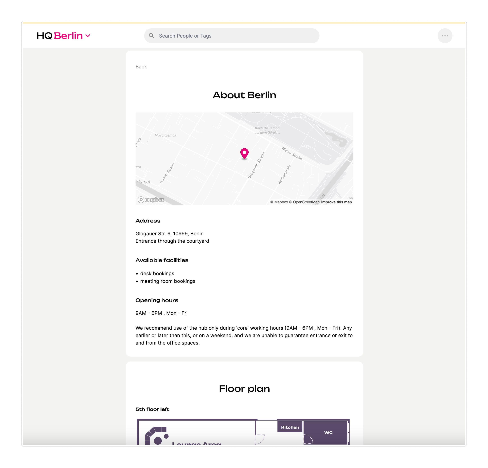
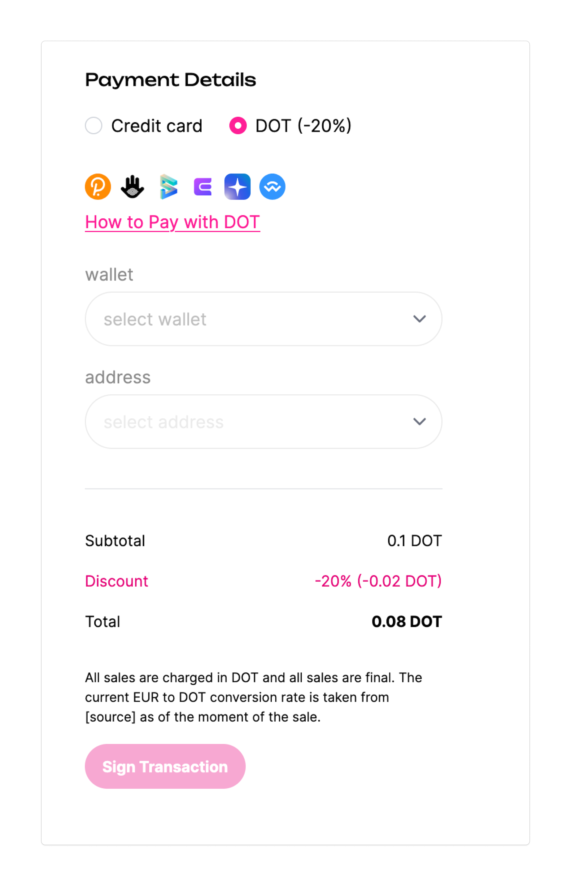
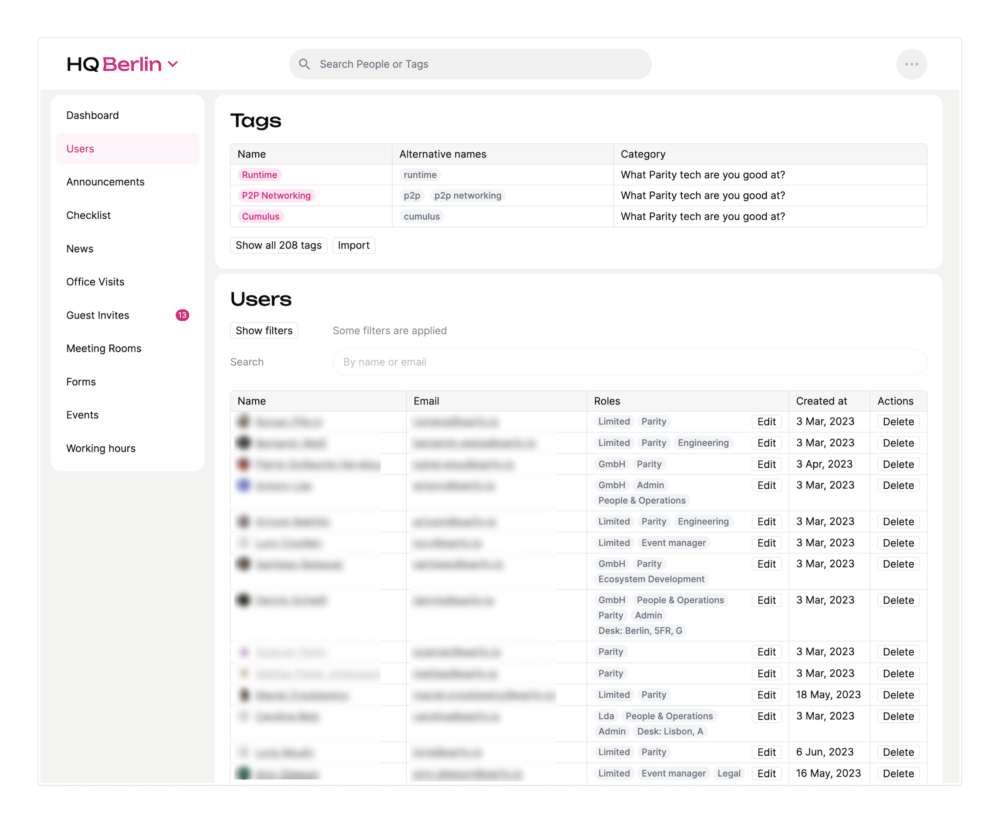

# Functionality

Definition: OSS, a self-hosted web app for managing physical space. Each instance can hold multiple hubs. E.g. A company A has a space and London and Berlin. They can have both spaces on one instance.

Features:

- Auth: Google SSO & Polkadot. (NFT coming soon)
- Rich, detailed profiles (personal information, contacts, tags, map with location).
- People/community can search for each other within the app by name/skills/social media handles
- Your hub can be presented in different cities (refer to Acme: Berlin, Lisbon, London).
- Hub space map listed on the home page.
- Working desk reservation.
- Meeting room reservation.
- Inviting a guest to the hub space.
- Built-in form builder (GDPR-friendly Google Forms alternative).
- Event management (admins can organize/approve people's attendance for the events hosted within the hub space).
- Announcements on the home page.
- Checklists on the home page.
- Simple blog platform (News).
- Almost all texts within the UI and notifications can be customised
- Admins have access to hub usage statistics (visits, bookings, registrations etc)
- Admins can manually give users permissions

Configuration:

Each hub can create its own unique configuration

- Configure your own membership types
- The app configuration determines the level of access for each user. This makes it possible to specify special groups of people with certain scopes of possible actions for each module.
- Hubs can turn on/off modules of the app. E.g. if you do not need news or events you can simply turn it off and those modules will not be shown
- Hubs can change the position of modules on the page

All the features are available as separate plugins (modules).

In order to run the app, a developer needs to define all configurations in the JSON files and use a publicly available Docker image.

## Main page with interactive map

## Login

- Google SSO
- Polkadot
- NFT (coming soon)

## User profiles

- Rich, detailed profiles (personal information, contacts, social media handles, tags, map with location).
- Each user can add tags to show their skills (searchable)

## Booking desks and meeting rooms on an interactive map

- See other people on the map unless they opt out
- Make bookings off the map directly

## Booking desks

- The desks which already booked will be grayed out

## Booking meeting rooms

- You can book any available meeting room for the time specified,
- or book a specific room and see its available times

## About Hub

- All important info for newcomers to the space in one spot

## Events

- People can apply for different events and see who is attending
- Events can be public or Hub internal

## Payments

- DOT payments (simply add your address to the configuration)
- Stripe payments (requires a Stripe account from the hub owner)

## Admin side

- Admins can manage all the records and see statistics on the following records: users, office visits, meeting room reservations, events, etc.

