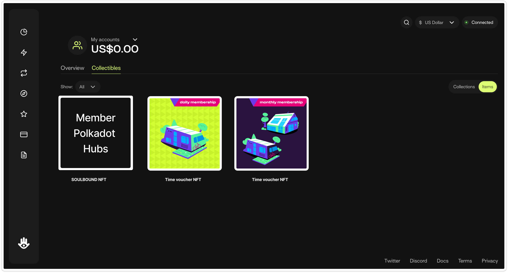
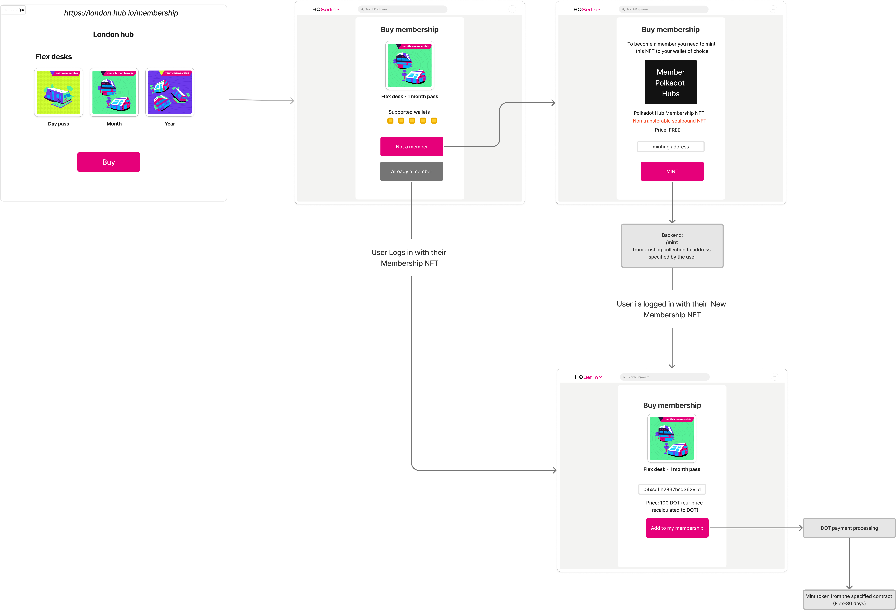

# NFT Membership concept



## Why?

- We want to promote ecosystem projects and utilize web3 technology. We will collaborate with Apillon, Talisman, Nova wallet and other projects in the ecosystem. We provide exposure, new users and help them evolve.
- This membership concept can serve as an example use case for other projects, who might consider implemeting a similar membership/login system.
- Personalized touch to the membership - people own the NFT, NFTs can have unique imagery created by each hub if they wish to add their creative touch to it.
- This concept can be developed further and gamified in the future. We can award special NFTs which can allow specific actions to their owners, etc. If the main collection is created as nestable, we can allow futher modifications to the original NFT.

## Membership NFT

Polkadot Hubs is a network of hubs. Each member of this network will get 1 free unique soulbound NFT. This NFT serves as member's main identification. Soulbound NFTs cannot be moved to another wallet, they will always stay in the wallet they were minted to.

The main reasoning behind having Soulbound NFTs is to avoid multiple people using the same membership ID, and posing as one member. If we do not use Soulbound NFTs then people can share the Memberhips NFT and pose as 1 person, attending the same hub.

The minting costs are covered by the hub.

Ownership of a Membership NFT will not allow physical access to a hub. In order to access the hub a Time based voucher NFT has to be purchased. However the hub owner can have exceptions. E.g. members with no time vouchers can access certain public events, etc.

## Time voucher NFT

Each hub will decide on their own membership structure and can configure their own membership roles. Access to the member parts of the app and physical access to the hub is only possible if a member owns a "time based voucher" or an NFT with metadata defining the access.

Sample Metadata

```
expirationDate: YYYY-MM-DD
type: flexible
location: London
```

### Example:

Hub A offers:

- flexible desks
- fixed desks
- casual access.

They also offer access for 30 days, 60 days and 90 days, that they charge for.

The hub will create x different NFT collections, where each collection will represent 1 membership type.

Potential Membership collections:

```
30-days flex
60-days flex
90-days flex
30-days fixed
60-days fixed
90-days fixed
30-days casual
60-days casual
90-days casual
```

All of the collection ids of the above collections are added to the configuration of the hub. The Hub can remove/add new collections as they please.

## Member permissions

Membership NFT allows to login as a guest to any of the Polkadot Hubs. It will depend on each hub what sort of permissions will be available to guests. This can be modified in the configuration of the hub app.

## Global membership

Global member is a person who own a specific Global Membership NFT. This person has to stake a certain amount of DOT in order to support their Membership. Doing so allows them to physically access any hub of the Polkadot Hub network without purchasing any time based voucher NFTs for access.

These types of memeberships will not be freely accessible, they will be granted to certain members of the community.

## Membership purchase flow


